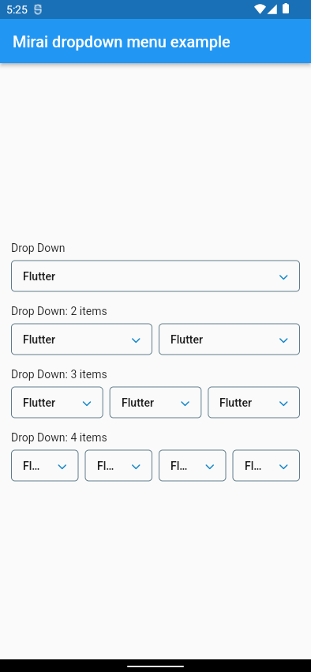
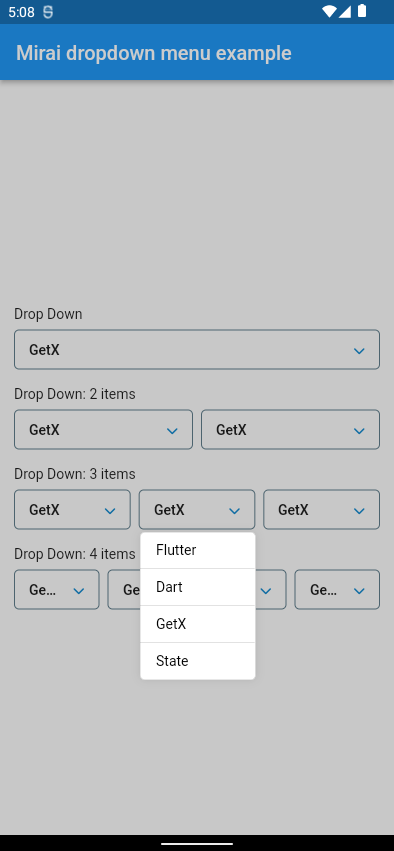
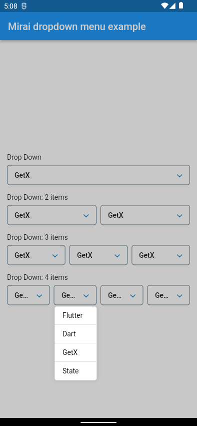
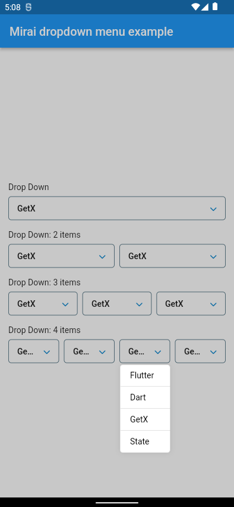
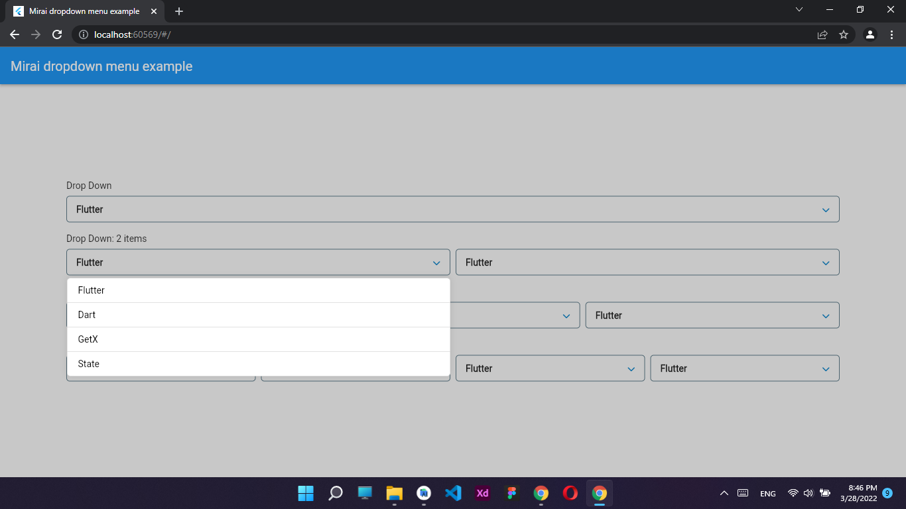
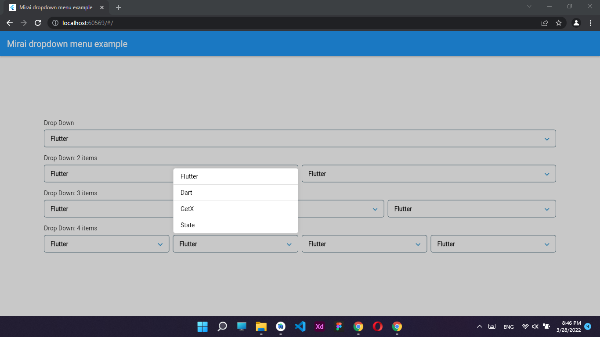

<!-- 
This README describes the package. If you publish this package to pub.dev,
this README's contents appear on the landing page for your package.

For information about how to write a good package README, see the guide for
[writing package pages](https://dart.dev/guides/libraries/writing-package-pages). 

For general information about developing packages, see the Dart guide for
[creating packages](https://dart.dev/guides/libraries/create-library-packages)
and the Flutter guide for
[developing packages and plugins](https://flutter.dev/developing-packages). 
-->

## MiraiDevs <contact@miraidevs.com>

TODO: Put a short description of the package here that helps potential users
know whether this package might be useful for them.

## Features

TODO: List what your package can do. Maybe include images, gifs, or videos.

## Getting started

TODO: List prerequisites and provide or point to information on how to
start using the package.

## Usage

TODO: Include short and useful examples for package users. Add longer examples
to `/example` folder. 

```dart
dependencies:
  mirai_dropdown_menu: <latest_version>
```

## Additional information

TODO: Tell users more about the package: where to find more information, how to 
contribute to the package, how to file issues, what response they can expect 
from the package authors, and more.

## Mobile:

### Example


### 1 item


### 2 items


### 3 items




### 4 items





## Web and Desktop:






