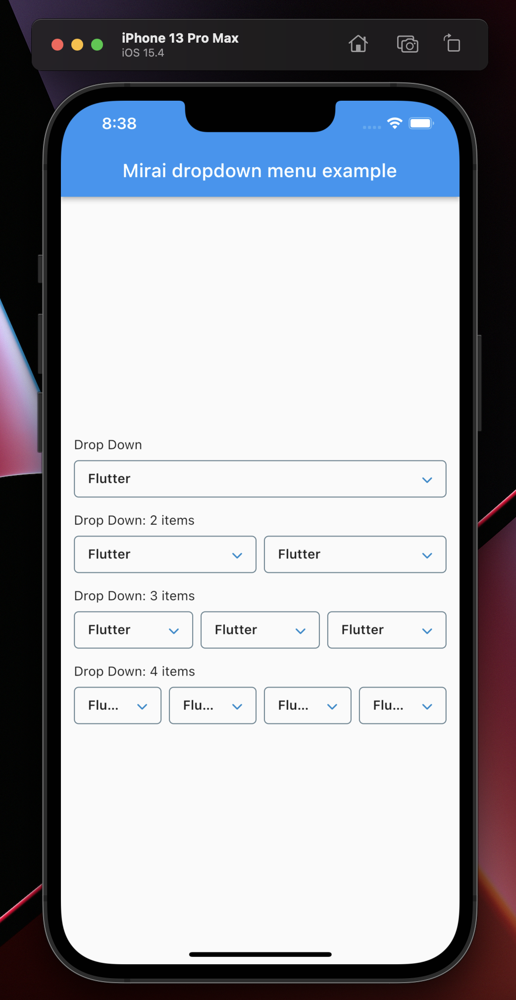
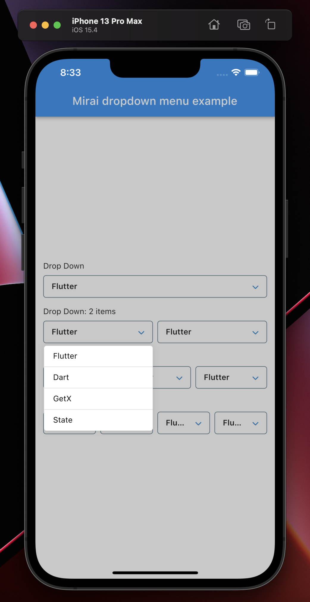
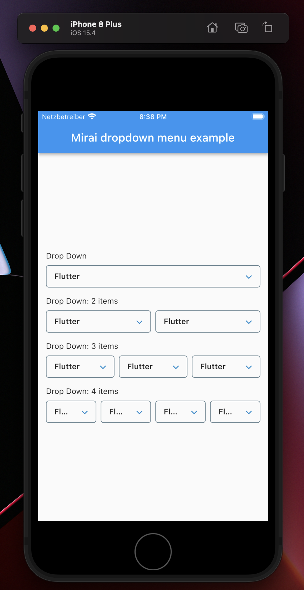
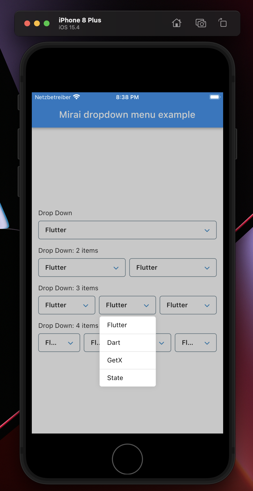

<!-- 
This README describes the package. If you publish this package to pub.dev,
this README's contents appear on the landing page for your package.

For information about how to write a good package README, see the guide for
[writing package pages](https://dart.dev/guides/libraries/writing-package-pages). 

For general information about developing packages, see the Dart guide for
[creating packages](https://dart.dev/guides/libraries/create-library-packages)
and the Flutter guide for
[developing packages and plugins](https://flutter.dev/developing-packages). 
-->


## MiraiDevs <contact@miraidevs.com>

<!-- 
TODO: Put a short description of the package here that helps potential users
know whether this package might be useful for them.

## Features

TODO: List what your package can do. Maybe include images, gifs, or videos.

## Getting started

TODO: List prerequisites and provide or point to information on how to
start using the package.


TODO: Include short and useful examples for package users. Add longer examples
to `/example` folder. 
-->

## Take a first look


## Installation 
1. Add mirai_dropdown_menu as a dependency in your pubspec.yaml file.

```dart
dependencies:
  mirai_dropdown_menu: <latest_version>
```

2. Import the mirai_dropdown_menu package.
 
```dart
import 'package:mirai_dropdown_menu/mirai_dropdown_menu.dart';
```

### Please check the example for more information:
```dart
  https://github.com/devhch/mirai_dropdown_menu/tree/master/example
```

## Usage:

```dart
class MiraiDropdownWidget<T> extends StatelessWidget {
  const MiraiDropdownWidget({
    Key? key,
    required this.valueNotifier,
    required this.itemWidget,
    required this.children,
    required this.onChanged,
    this.underline = false,
    this.showSeparator = true,
    this.exit = MiraiExit.fromAll,
    this.chevronDownColor,
    this.dropdownChild,
    this.showMode = MiraiShowMode.bottom,
  }) : super(key: key);

  final ValueNotifier<String> valueNotifier;
  final MiraiDropdownBuilder<T> itemWidget;
  final List<T> children;
  final ValueChanged<T> onChanged;
  final bool underline;
  final bool showSeparator;
  final MiraiExit exit;
  final Color? chevronDownColor;
  final Widget? dropdownChild;
  final MiraiShowMode showMode;

  @override
  Widget build(BuildContext context) {
    return MiraiPopupMenu<T>(
      key: UniqueKey(),
      enable: true,
      space: 4,
      showMode: showMode,
      exit: exit,
      showSeparator: showSeparator,
      child: Container(
        key: GlobalKey(),
        padding: const EdgeInsets.symmetric(
          horizontal: 14,
        ),
        decoration: BoxDecoration(
          borderRadius: underline ? null : BorderRadius.circular(5.0),
          border: underline
              ? const Border(
                  bottom: BorderSide(
                    width: 1.0,
                    color: Colors.blueGrey,
                  ),
                )
              : Border.all(
                  color: Colors.blueGrey,
                  width: 1.0,
                ),
        ),
        height: 40,
        child: dropdownChild ??
            Row(
              mainAxisAlignment: MainAxisAlignment.spaceBetween,
              children: [
                Flexible(
                  child: ValueListenableBuilder<String>(
                    valueListenable: valueNotifier,
                    builder: (_, String chosenTitle, __) {
                      return AnimatedSwitcher(
                        duration: const Duration(milliseconds: 600),
                        child: Text(
                          chosenTitle,
                          key: ValueKey(chosenTitle.trim()),
                          style: const TextStyle(
                            fontWeight: FontWeight.w600,
                          ),
                          overflow: TextOverflow.ellipsis,
                        ),
                      );
                    },
                  ),
                ),
                const SizedBox(width: 16),
                FaIcon(
                  FontAwesomeIcons.chevronDown,
                  color: chevronDownColor ?? AppTheme.keyAppColor,
                  size: 12,
                ),
              ],
            ),
      ),
      children: children,
      itemWidget: itemWidget,
      onChanged: onChanged,
    );
  }
}
```

## List of items and ValueNotifier:
```dart
  final List<String> listOfItem = <String>[
    'Flutter',
    'Dart',
    'GetX',
    'State',
  ];

  late ValueNotifier<String> valueNotifier;

  @override
  void initState() {
    super.initState();
    valueNotifier = ValueNotifier<String>(
      listOfItem.first,
    );
  }
```

## Then you can use the dropdown widget in build:
```dart
        MiraiDropdownWidget(
                valueNotifier: valueNotifier,
                itemWidget: (int index, String item) {
                  return MiraiDropDownItemWidget(item: item);
                },
                children: listOfItem,
                onChanged: (String value) {
                  valueNotifier.value = value;
                },
              ),
```

## MiraiDropDownItemWidget:
```dart
/*
* Created By Mirai Devs.
* On 3/28/2022.
*/

import 'package:flutter/material.dart';

class MiraiDropDownItemWidget extends StatelessWidget {
  const MiraiDropDownItemWidget({
    Key? key,
    required this.item,
  }) : super(key: key);

  final String item;

  @override
  Widget build(BuildContext context) {
    return Padding(
      padding: const EdgeInsets.symmetric(
        vertical: 10.0,
        horizontal: 16.0,
      ),
      child: Text(
        item,
        style: const TextStyle(
          color: Colors.black,
        ),
      ),
    );
  }
}
```
<!-- 
## Additional information

TODO: Tell users more about the package: where to find more information, how to 
contribute to the package, how to file issues, what response they can expect 
from the package authors, and more.
-->

## iOS:

### iPhone 13 Pro Max



### iPhone 8 Plus



## Android:

### Example


### 1 item


### 2 items


### 3 items


### 4 items


## Web and Desktop:


