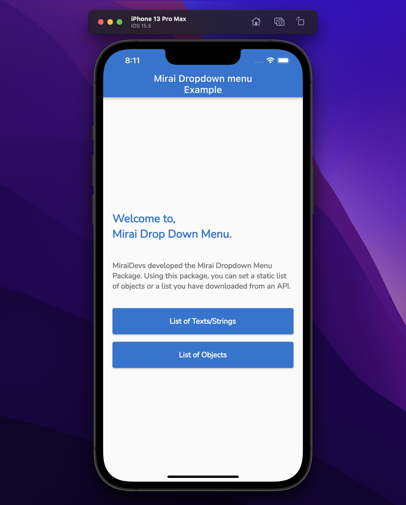

<!-- 
This README describes the package. If you publish this package to pub.dev,
this README's contents appear on the landing page for your package.

For information about how to write a good package README, see the guide for
[writing package pages](https://dart.dev/guides/libraries/writing-package-pages). 

For general information about developing packages, see the Dart guide for
[creating packages](https://dart.dev/guides/libraries/create-library-packages)
and the Flutter guide for
[developing packages and plugins](https://flutter.dev/developing-packages). 
-->


## MiraiDevs <contact@miraidevs.com>

## Description
MiraiDevs developed the Mirai Dropdown Menu Package.

## Features
* You can set a static list of objects or a list you have downloaded from an API.
* Search for items...

## Getting started

## Take a first look:




## Installation

1. Add mirai_dropdown_menu as a dependency in your pubspec.yaml file.

```dart
dependencies:
  mirai_dropdown_menu: <latest_version>
```

2. Import the mirai_dropdown_menu package.

```dart
import 'package:mirai_dropdown_menu/mirai_dropdown_menu.dart';
```

## Usage

Create mirai_dropdown_widget.dart:
```dart
class MiraiDropdownWidget<String> extends StatelessWidget {
  const MiraiDropdownWidget({
    Key? key,
    required this.valueNotifier,
    required this.itemWidgetBuilder,
    required this.children,
    required this.onChanged,
    this.underline = false,
    this.showSeparator = true,
    this.exit = MiraiExit.fromAll,
    this.chevronDownColor,
    this.showMode = MiraiShowMode.bottom,
    this.maxHeight,
    this.showSearchTextField = false,
    this.showOtherAndItsTextField = false,
    this.other,
  }) : super(key: key);

  final ValueNotifier<String> valueNotifier;
  final MiraiDropdownBuilder<String> itemWidgetBuilder;
  final List<String> children;
  final ValueChanged<String> onChanged;
  final bool underline;
  final bool showSeparator;
  final MiraiExit exit;
  final Color? chevronDownColor;
  final MiraiShowMode showMode;
  final double? maxHeight;
  final bool showSearchTextField;
  final bool showOtherAndItsTextField;
  final Widget? other;

  @override
  Widget build(BuildContext context) {
    return MiraiPopupMenu<String>(
      key: UniqueKey(),
      enable: true,
      space: 4,
      showMode: showMode,
      exit: exit,
      showSeparator: showSeparator,
      children: children,
      itemWidgetBuilder: itemWidgetBuilder,
      onChanged: onChanged,
      maxHeight: maxHeight,
      showOtherAndItsTextField: showOtherAndItsTextField,
      showSearchTextField: showSearchTextField,
      other: other,
      child: Container(
        key: GlobalKey(),
        padding: const EdgeInsets.symmetric(
          horizontal: 14,
        ),
        decoration: BoxDecoration(
          borderRadius: underline ? null : BorderRadius.circular(5.0),
          border: underline
              ? const Border(
            bottom: BorderSide(
              width: 1.0,
              color: Colors.blueGrey,
            ),
          )
              : Border.all(
            color: Colors.blueGrey,
            width: 1.0,
          ),
        ),
        height: 40,
        child: Row(
          mainAxisAlignment: MainAxisAlignment.spaceBetween,
          children: <Widget>[
            Flexible(
              child: ValueListenableBuilder<String>(
                valueListenable: valueNotifier,
                builder: (_, String chosenTitle, __) {
                  return AnimatedSwitcher(
                    duration: const Duration(milliseconds: 200),
                    child: Text(
                      '$chosenTitle',
                      key: ValueKey<String>(chosenTitle),
                      style: const TextStyle(
                        fontWeight: FontWeight.w600,
                      ),
                      overflow: TextOverflow.ellipsis,
                    ),
                  );
                },
              ),
            ),
            const SizedBox(width: 16),
            FaIcon(
              FontAwesomeIcons.chevronDown,
              color: chevronDownColor ?? AppTheme.keyAppColor,
              size: 12,
            ),
          ],
        ),
      ),
    );
  }
}
```

Create mirai_dropdown_item_widget.dart
```dart
class MiraiDropDownItemWidget extends StatelessWidget {
  const MiraiDropDownItemWidget({
    Key? key,
    required this.item,
  }) : super(key: key);

  final String item;

  @override
  Widget build(BuildContext context) {
    return Padding(
      padding: const EdgeInsets.symmetric(
        vertical: 10.0,
        horizontal: 16.0,
      ),
      child: Text(
        item,
        style: const TextStyle(
          color: Colors.black,
        ),
      ),
    );
  }
}
```

Then you can use MiraiDropdownWidget like this:
```dart
MiraiDropdownWidget<String>(
  valueNotifier: valueNotifierFirst,
  itemWidgetBuilder: (int index, String item) {
    return MiraiDropDownItemWidget(item: item);
  },
  children: listOfItem,
  onChanged: (String value) {
  valueNotifierFirst.value = value;
  },
),
```

To Show Search Text Field:
```dart
MiraiDropdownWidget<String>(
  valueNotifier: valueNotifierFirst,
  showSearchTextField: true,
  itemWidgetBuilder: (int index, String item) {
    return MiraiDropDownItemWidget(item: item);
  },
  children: listOfItem,
  onChanged: (String value) {
  valueNotifierFirst.value = value;
  },
),
```

###  [Please check the example for more information](https://github.com/devhch/mirai_dropdown_menu/tree/master/example)

## Support

If the MiraiDropDown package matches your needs, please do not hesitate to support the package, I would be very grateful if you buy me a cup of coffee.

<a href="https://www.buymeacoffee.com/miraidevs" target="_blank"></a>

## iOS:

#### List Of Objects:


#### List Of Texts / Strings:


