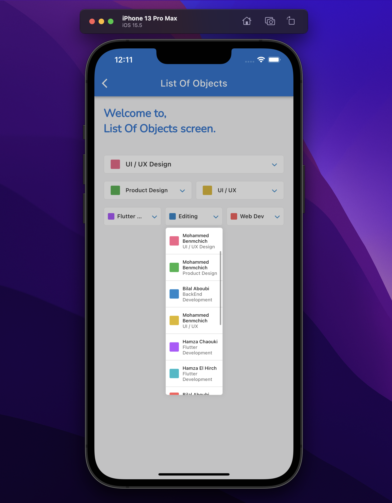
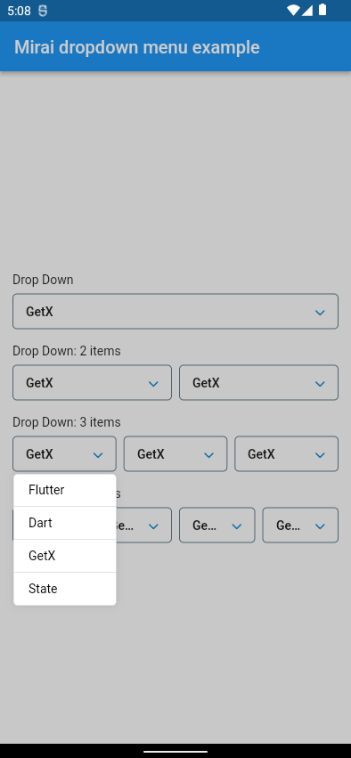
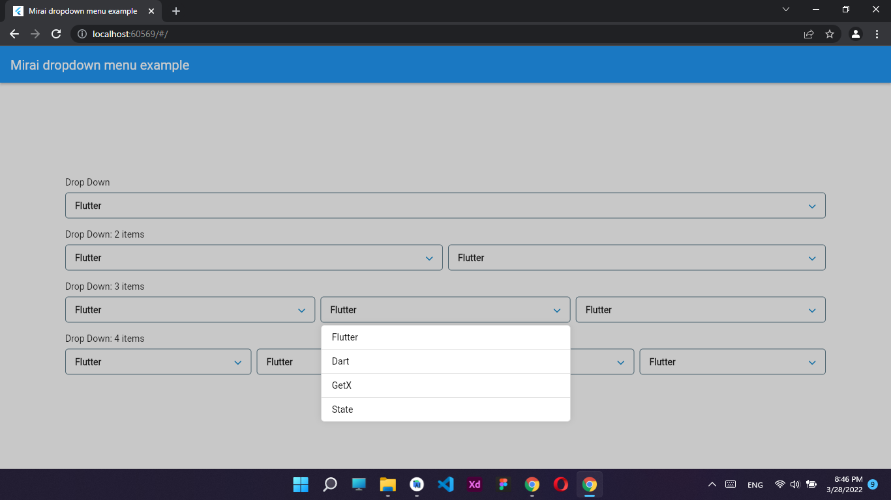

<!-- 
This README describes the package. If you publish this package to pub.dev,
this README's contents appear on the landing page for your package.

For information about how to write a good package README, see the guide for
[writing package pages](https://dart.dev/guides/libraries/writing-package-pages). 

For general information about developing packages, see the Dart guide for
[creating packages](https://dart.dev/guides/libraries/create-library-packages)
and the Flutter guide for
[developing packages and plugins](https://flutter.dev/developing-packages). 
-->


## MiraiDevs <contact@miraidevs.com>

<!-- 
TODO: Put a short description of the package here that helps potential users
know whether this package might be useful for them.

## Features

TODO: List what your package can do. Maybe include images, gifs, or videos.

## Getting started

TODO: List prerequisites and provide or point to information on how to
start using the package.


TODO: Include short and useful examples for package users. Add longer examples
to `/example` folder. 
-->

## Take a first look:


## Installation

1. Add mirai_dropdown_menu as a dependency in your pubspec.yaml file.

```dart
dependencies:mirai_dropdown_menu: <
latest_version>
```

2. Import the mirai_dropdown_menu package.

```dart
import 'package:mirai_dropdown_menu/mirai_dropdown_menu.dart';
```

###  [Please check the example for more information](https://github.com/devhch/mirai_dropdown_menu/tree/master/example)

<!-- 
## Additional information

TODO: Tell users more about the package: where to find more information, how to 
contribute to the package, how to file issues, what response they can expect 
from the package authors, and more.
-->

## iOS:

### iPhone 13 Pro Max

#### List Of Objects:




#### List Of Texts / Strings:


## Android:


### 1 item


### 2 items


### 3 items




### 4 items


## Web and Desktop:





## Support

If Mirai DropDown package was useful to you, saved you a lot of time, or you just want to support the project, I would be very grateful if you buy me a cup of coffee.

<a href="https://www.buymeacoffee.com/miraidevs" target="_blank"></a>


